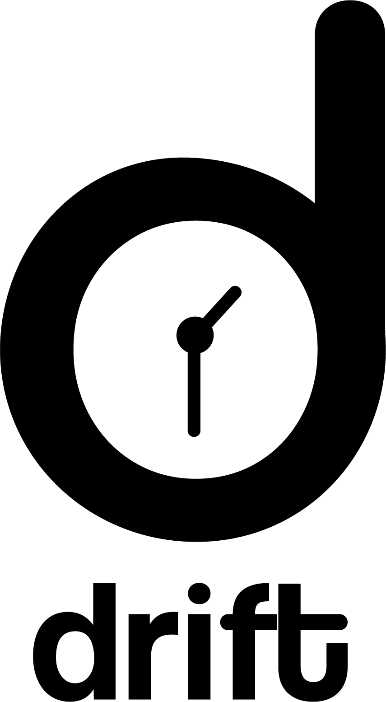

<p align="center">
  
</p>

DRIFT is a tool for diachronic analysis of scientific articles. We would love to know about any issues found on this repository. Please create an issue for any query, or contact us at sharmabhee@gmail.com.

Pre-print: Coming Soon!

## Abstract


## Updates
- [26 June 2021]: Repository is about to go public!

## Directory Structure

You can find the structure of the repository (i.e., the sub-directories and files) [here](misc/DIRSTRUCTURE.md).

## Usage

### Setting Up

Clone the repository.

```sh
git clone https://github.com/rajaswa/diachronic-analysis-acl-anthology.git
cd diachronic-analysis-acl-anthology
```

Install the requirements.

```sh
make install_req
```

### Datasets

The dataset we have used for our analysis in the paper was scraped using the arXiv API. We scraped papers from the cs.CL subject. It is available [here](https://drive.google.com/drive/folders/1boRFknjKieEVWxansaoMTO_3YbMf6kr9?usp=sharing).

The user can upload his/her own dataset. The unprocessed dataset should be present in the following format (as a json file):

```sh
{
   <year_1>:[
      <paper_1>,
      <paper_2>,
      ...
   ],
   <year_2>:[
      <paper_1>,
      <paper_2>,
      ...
   ],
   ...,
   <year_m>:[
      <paper_1>,
      <paper_2>,
      ...
   ],
}

```

where ```year_x``` is a string (e.g., ```"1998"```), and ```paper_x``` is a dictionary. An example is given below:


```sh
{
   "url":"http://arxiv.org/abs/cs/9809020v1",
   "date":"1998-09-15 23:49:32+00:00",
   "title":"Linear Segmentation and Segment Significance",
   "authors":[
      "Min-Yen Kan",
      "Judith L. Klavans",
      "Kathleen R. McKeown"
   ],
   "abstract":"We present a new method for discovering a segmental discourse structure of a\ndocument while categorizing segment function. We demonstrate how retrieval of\nnoun phrases and pronominal forms, along with a zero-sum weighting scheme,\ndetermines topicalized segmentation. Futhermore, we use term distribution to\naid in identifying the role that the segment performs in the document. Finally,\nwe present results of evaluation in terms of precision and recall which surpass\nearlier approaches.",
   "journal ref":"Proceedings of 6th International Workshop of Very Large Corpora\n  (WVLC-6), Montreal, Quebec, Canada: Aug. 1998. pp. 197-205",
   "category":"cs.CL"
}

```

The only important key is ```"abstract"```, which has the raw text. The user can name this key differently. See the ```Training``` section below for more details.


### Launch the app

To launch the app, run the following command from the terminal:

```sh
streamlit run app.py

```

The app has two modes: **Train** and **Analysis**.

### Train Mode

### Analysis Mode

## Tasks

- [x] Add Usage.
- [x] Add Citation(s).
- [x] Update `README.md`.
- [x] Add Directory Structure.

## Citation

You can cite our work as:

```sh
@unpublished{sharma2021DRIFT ,
author = {Abheesht Sharma and Gunjan Chhablani and Harshit Pandey and Rajaswa Patil},
title = {DRIFT: A Tool for Diachronic Analysis of Scientific Articles},
note = {Under Review at EMNLP 2021 (Demo Track)},
year = {2021}
}
```
OR

```sh
A. Sharma, G. Chhablani, H. Pandey, R. Patil, "DRIFT: A Tool for Diachronic Analysis of Scientific Articles", Under Review at EMNLP 2021 (Demo Track), 2021.
```
