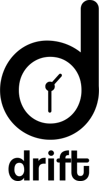

<p align="center">
  
</p>

<div align='center'>

  [](https://github.com/rajaswa/DRIFT/blob/main/LICENSE)
  [](https://github.com/rajaswa/DRIFT/stargazers)
  [](https://github.com/rajaswa/DRIFT/network)
  [](https://github.com/rajaswa/DRIFT/issues)
  
</div>

<div align='center'>
  
[](https://share.streamlit.io/rajaswa/drift/main/app.py)
[](http://arxiv.org/abs/2107.01198)

</div>

---

## About

**DRIFT is a tool for Diachronic Analysis of Scientific Literature**. The application offers **user-friendly** and **customizable utilities** for two modes: **[Training](https://github.com/rajaswa/DRIFT#train-mode)** and **[Analysis](https://github.com/rajaswa/DRIFT#analysis-mode)**. Currently, the application supports customizable training of diachronic word embeddings with the **[TWEC model](https://github.com/valedica/twec)**. The application supports a variety of analysis methods to monitor **trends and patterns of development in scientific literature**:

1. [Word Cloud](https://github.com/rajaswa/DRIFT#word-cloud)
2. [Productivity/Frequency Plot](https://github.com/rajaswa/DRIFT#productivityfrequency-plot)
3. [Acceleration Plot](https://github.com/rajaswa/DRIFT#acceleration-plot)
4. [Semantic Drift](https://github.com/rajaswa/DRIFT#semantic-drift)
5. [Tracking Clusters](https://github.com/rajaswa/DRIFT#tracking-clusters)
6. [Acceleration Heatmap](https://github.com/rajaswa/DRIFT#acceleration-heatmap)
7. [Track Trends with Similarity](https://github.com/rajaswa/DRIFT#track-trends-with-similarity)
8. [Keyword Visualisation](https://github.com/rajaswa/DRIFT#keyword-visualisation)
9. [LDA Topic Modelling](https://github.com/rajaswa/DRIFT#lda-topic-modelling)

**NOTE**: The [online demo](https://share.streamlit.io/gchhablani/drift/main/app.py) is hosted using [Streamlit sharing](https://docs.streamlit.io/en/stable/deploy_streamlit_app.html). This is a single-instance single-process deployment, accessible to all the visitors publicly **(avoid sharing sensitive information on the demo)**. Hence, **it is highly recommended to use your own independent local deployment of the application for a seamless and private experience. One can alternatively fork this repository and host it using [Streamlit sharing](https://docs.streamlit.io/en/stable/deploy_streamlit_app.html).**

We would love to know about any issues found on this repository. Please submit an [issue](https://github.com/rajaswa/DRIFT/issues/new/choose) for any query, or contact us [here](mailto:sharmabhee@gmail.com). If you use this application in your work, you can cite this repository and the paper [here](https://github.com/rajaswa/DRIFT#citation).

---

## Setup

Clone the repository:

```bash
git clone https://github.com/rajaswa/DRIFT.git
cd DRIFT
```

Install the requirements:

```bash
make install_req
```

## Data

The dataset we have used for our demo, and the analysis in the paper was scraped using the `arXiv API` (see [script](https://github.com/rajaswa/DRIFT/blob/main/crawl_arxiv.py)). We scraped papers from the `cs.CL` subject. This dataset is available [here](https://drive.google.com/drive/folders/1boRFknjKieEVWxansaoMTO_3YbMf6kr9?usp=sharing).

The user can upload their own dataset to the **DRIFT** application. The unprocessed dataset should be present in the following format (as a JSON file):

```python
{
   <year_1>:[
      <paper_1>,
      <paper_2>,
      ...
   ],
   <year_2>:[
      <paper_1>,
      <paper_2>,
      ...
   ],
   ...,
   <year_m>:[
      <paper_1>,
      <paper_2>,
      ...
   ],
}

```

where ```year_x``` is a string (e.g., ```"1998"```), and ```paper_x``` is a dictionary. An example is given below:


```python
{
   "url":"http://arxiv.org/abs/cs/9809020v1",
   "date":"1998-09-15 23:49:32+00:00",
   "title":"Linear Segmentation and Segment Significance",
   "authors":[
      "Min-Yen Kan",
      "Judith L. Klavans",
      "Kathleen R. McKeown"
   ],
   "abstract":"We present a new method for discovering a segmental discourse structure of a\ndocument while categorizing segment function. We demonstrate how retrieval of\nnoun phrases and pronominal forms, along with a zero-sum weighting scheme,\ndetermines topicalized segmentation. Futhermore, we use term distribution to\naid in identifying the role that the segment performs in the document. Finally,\nwe present results of evaluation in terms of precision and recall which surpass\nearlier approaches.",
   "journal ref":"Proceedings of 6th International Workshop of Very Large Corpora\n  (WVLC-6), Montreal, Quebec, Canada: Aug. 1998. pp. 197-205",
   "category":"cs.CL"
}

```

The only important key is ```"abstract"```, which has the raw text. The user can name this key differently. See the ```Training``` section below for more details.

---

## Usage

### Launch the app

To launch the app, run the following command from the terminal:

```bash
streamlit run app.py

```

### Train Mode

#### Preprocesing
The preprocessing stage takes a JSON file structured as shown in the [Data](https://github.com/rajaswa/DRIFT#data) section. They key for raw text is provided on which preprocessing takes place. During the preprocessing of the text, year-wise text files are created in a desired directory. During the preprocessing:
- All html tags are removed from the text.
- Contractions are replaced (e.g. 'don't' is converted to 'do not')
- Punctuations, non-ascii characters, stopwords are removed.
- All verbs are lemmatized.

After this, each processed text is stored in the respective year file separated by a new-line, along with all the data in a single file as `compass.txt`

#### Training

<p align="center">
  
</p>

The training mode uses the path where the processed text files are stored, and trains the TWEC model on the given text. The TWEC model trains a Word2Vec model on `compass.txt` and then the respective time-slices are trained on this model to get corresponding word vectors. In the sidebar, we provide several options like - whether to use Skipgram over CBOW, number of dynamic iterations for training, number of static iterations for training, negative sampling, etc. After training, we store the models at the specified path, which are used later in the analysis.


### Analysis Mode

#### Word Cloud

<p align="center">
  
</p>

A word cloud, or tag cloud, is a textual data visualization which allows anyone to see in a single glance the words which have the highest frequency within a given body of text. Word clouds are typically used as a tool for processing, analyzing and disseminating qualitative sentiment data.

References:
- [Word Cloud Explorer: Text Analytics based on Word Clouds](https://ieeexplore.ieee.org/stamp/stamp.jsp?tp=&arnumber=6758829)
- [wordcloud Package](https://amueller.github.io/word_cloud/generated/wordcloud.WordCloud.html)
- [Free Word Cloud Generator](https://www.freewordcloudgenerator.com)


#### Productivity/Frequency Plot

<p align="center">
  
</p>

Our main reference for this method is [this paper](https://www.aclweb.org/anthology/W16-2101.pdf).
In short, this paper uses normalized term frequency and term producitvity as their measures.

- **Term Frequency**: This is the normalized frequency of a given term in a given year.
- **Term Productivity**: This is a measure of the ability of the concept to produce new multi-word terms. In our case we use bigrams. For each year *y* and single-word term *t*, and associated *n* multi-word terms *m*, the productivity is given by the entropy:

<p align="center">
  
</p>

<p align="center">
  
</p>


Based on these two measures, they hypothesize three kinds of terms:
- **Growing Terms**: Those which have increasing frequency and productivity in the recent years.
- **Consolidated Terms**: Those that are growing in frequency, but not in productivity.
- **Terms in Decline**: Those which have reached an upper bound of productivity and are being used less in terms of frequency.

Then, they perform clustering of the terms based on their frequency and productivity curves over the years to test their hypothesis.
They find that the clusters formed show similar trends as expected.

**NOTE**: They also evaluate quality of their clusters using pseudo-labels, but we do not use any automated labels here. They also try with and without double-counting multi-word terms, but we stick to double-counting. They suggest it is more explanable.


#### Acceleration Plot

<p align="center">
  
</p>

This plot is based on the word-pair acceleration over time. Our inspiration for this method is [this paper](https://ieeexplore.ieee.org/document/8852140).
Acceleration is a metric which calculates how quickly the word embeddings for a pair of word get close together or farther apart. If they are getting closer together, it means these two terms have started appearing more frequently in similar contexts, which leads to similar embeddings.
In the paper, it is described as:

<p align="center">
  
</p>

<p align="center">
  
</p>


Below, we display the top few pairs between the given start and end year in  dataframe, then one can select years and then select word-pairs in the plot parameters expander. A reduced dimension plot is displayed.

**NOTE**: They suggest using skip-gram method over CBOW for the model. They use t-SNE representation to view the embeddings. But their way of aligning the embeddings is different. They also use some stability measure to find the best Word2Vec model. The also use *Word2Phrase* which we are planning to add soon.


#### Semantic Drift

<p align="center">
  
</p>

This plot represents the change in meaning of a word over time. This shift is represented on a 2-dimensional representation of the embedding space.
To find the drift of a word, we calculate the distance between the embeddings of the word in the final year and in the initial year. We find the drift for all words and sort them in descending order to find the most drifted words.
We give an option to use one of two distance metrics: Euclidean Distance and Cosine Distance.

<p align="center">
  
</p>

<p align="center">
  
</p>


We plot top-K (sim.) most similar words around the two representations of the selected word.

In the ```Plot Parameters``` expander, the user can select the range of years over which the drift will be computed. He/She can also select the dimensionality reduction method for plotting the embeddings.

Below the graph, we provide a list of most drifted words (from the top-K keywords). The user can also choose a custom word.


#### Tracking Clusters

<p align="center">
  
</p>

Word meanings change over time. They come closer or drift apart. In a certain year, words are clumped together, i.e., they belong to one cluster. But over time, clusters can break into two/coalesce together to form one. Unlike the previous module which tracks movement of one word at a time, here, we track the movement of clusters.

We plot the formed clusters for all the years lying in the selected range of years.
**NOTE:** We give an option to use one of two libraries for clustering: sklearn or faiss. faiss' KMeans implementation is around 10 times faster than sklearn's.


#### Acceleration Heatmap

<p align="center">
  
</p>

This plot is based on the word-pair acceleration over time. Our inspiration for this method is [this paper](https://sci-hub.se/10.1109/ijcnn.2019.8852140).
Acceleration is a metric which calculates how quickly the word embeddings for a pair of word get close together or farther apart. If they are getting closer together, it means these two terms have started appearing more frequently in similar contexts, which leads to similar embeddings.
In the paper, it is described as:

<p align="center">
  
</p>

<p align="center">
  
</p>

For all the selected keywords, we display a heatmap, where the brightness of the colour determines the value of the acceleration between that pair, i.e., the brightness is directly proportional to the acceleration value.

**NOTE**: They suggest using skip-gram method over CBOW for the model.


#### Track Trends with Similarity

<p align="center">
  
</p>

In this method, we wish to chart the trajectory of a word/topic from year 1 to year 2. 

To accomplish this, we allow the user to pick a word from year 1. At the same time, we ask the user to provide the desired stride. We search for the most similar word in the next stride years. We keep doing this iteratively till we reach year 2, updating the word at each step.

The user has to select a word and click on ```Generate Dataframe```. This gives a list of most similar words in the next stride years. The user can now iteratively select the next word from the drop-down till the final year is reached.


#### Keyword Visualisation

<p align="center">
  
</p>

Here, we use the [YAKE Keyword Extraction](https://www.sciencedirect.com/science/article/abs/pii/S0020025519308588) method to extract keywords. You can read more about YAKE [here](https://amitness.com/keyphrase-extraction/).

In our code, we use an [open source implementation](https://github.com/LIAAD/yake) of YAKE.

**NOTE:** Yake returns scores which are indirectly proportional to the keyword importance. Hence, we do the following to report the final scores:


<p align="center">
  
</p>


#### LDA Topic Modelling

<p align="center">
  
</p>

[Latent Dirichlet Allocation](https://www.jmlr.org/papers/volume3/blei03a/blei03a.pdf) is a generative probabilistic model for an assortment of documents, generally used for topic modelling and extraction. LDA clusters the text data into imaginary topics. 

Every topic can be represented as a probability distribution over ngrams and every document can be represented as a probability distribution over these generated topics. 

We train LDA on a corpus where each document contains the abstracts of a particular year. We express every year as a probability distribution of topics.

In the first bar graph, we show how a year can be decomposed into topics. The graphs below the first one show a decomposition of the relevant topics.


## Citation

You can cite our work as:

```bibtex
@inproceedings{sharma-etal-2021-drift,
    title = "{DRIFT}: A Toolkit for Diachronic Analysis of Scientific Literature",
    author = "Sharma, Abheesht  and
      Chhablani, Gunjan  and
      Pandey, Harshit  and
      Patil, Rajaswa",
    booktitle = "Proceedings of the 2021 Conference on Empirical Methods in Natural Language Processing: System Demonstrations",
    month = nov,
    year = "2021",
    address = "Online and Punta Cana, Dominican Republic",
    publisher = "Association for Computational Linguistics",
    url = "https://aclanthology.org/2021.emnlp-demo.40",
    doi = "10.18653/v1/2021.emnlp-demo.40",
    pages = "361--371",
}
```
OR

```bash
Abheesht Sharma, Gunjan Chhablani, Harshit Pandey, and Rajaswa Patil. 2021. DRIFT: A Toolkit for Diachronic Analysis of Scientific Literature. In Proceedings of the 2021 Conference on Empirical Methods in Natural Language Processing: System Demonstrations, pages 361–371, Online and Punta Cana, Dominican Republic. Association for Computational Linguistics.
```
